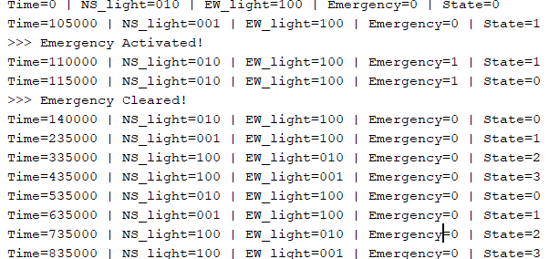
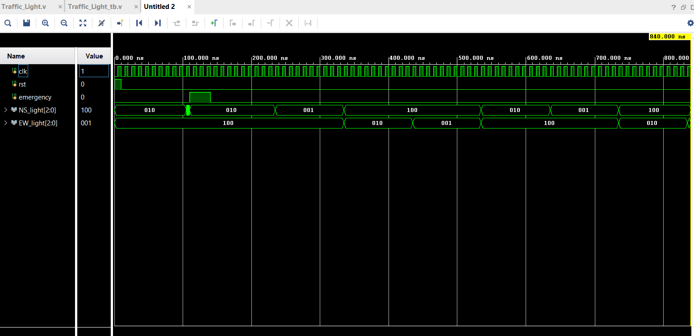

# 🚦 Traffic Light Controller (Verilog | FSM | RTL Design)

## 🧭 Overview
This project implements a **Finite State Machine (FSM)-based Traffic Light Controller** using **Verilog HDL**, designed to manage **North–South (NS)** and **East–West (EW)** traffic flow.  
The controller features **timed light sequencing**, **emergency override logic**, and a **fully synchronous state machine** driven by a clock and internal timer.

---

## ⚙️ Features
✅ **FSM-Controlled Operation:**  
Cycles through four primary traffic states:  
1. `NS_GREEN` → North–South vehicles move, East–West stops  
2. `NS_YELLOW` → North–South slows down  
3. `EW_GREEN` → East–West vehicles move, North–South stops  
4. `EW_YELLOW` → East–West slows down  

✅ **Emergency Override:**  
When the **emergency signal** is activated, all lights instantly switch to:  
- **North–South → Green**  
- **East–West → Red**  
After the emergency clears, normal cycling automatically resumes.  

✅ **Timer-Driven State Transition:**  
Each state lasts for **10 clock cycles**, managed by a 4-bit timer counter.  

✅ **Simulation-Friendly Testbench:**  
Includes a Verilog testbench (`Traffic_Light_tb.v`) that:  
- Generates a clock and reset  
- Triggers emergency mode mid-cycle  
- Monitors and prints all signal transitions  
- Dumps waveform data for viewing in GTKWave or Vivado  

---

## 🔄 FSM State Diagram
```
 ┌────────────┐       ┌────────────┐
 │  NS_GREEN  │──────▶│ NS_YELLOW  │
 └────────────┘       └────────────┘
       ▲                    │
       │                    ▼
 ┌────────────┐◀──────┌────────────┐
 │ EW_YELLOW  │       │  EW_GREEN  │
 └────────────┘       └────────────┘
```

During an **emergency**, the FSM temporarily halts and holds:
```
NS_light = GREEN
EW_light = RED
```

---

## 💡 Signal Encoding

| Signal | Meaning | Encoding |
|:-------|:---------|:----------|
| `NS_light`, `EW_light` | Traffic light outputs | 3-bit vector |
| RED | Stop | `100` |
| GREEN | Go | `010` |
| YELLOW | Prepare/Wait | `001` |

---

## 🧪 Simulation Results

### 🖥 Console Output Snapshot
```
Time=0      | NS_light=010 | EW_light=100 | Emergency=0 | State=0
Time=105000 | NS_light=001 | EW_light=100 | Emergency=0 | State=1
>>> Emergency Activated!
Time=110000 | NS_light=010 | EW_light=100 | Emergency=1 | State=1
>>> Emergency Cleared!
Time=140000 | NS_light=010 | EW_light=100 | Emergency=0 | State=0
...
```

The console verifies:
- Sequential cycling through 4 FSM states  
- Immediate emergency response  
- Correct restoration of normal operation after emergency clears  

### 📊 Waveform Output



- Green, Yellow, and Red transitions alternate properly  
- Emergency signal temporarily forces NS lane to green  
- Timer resets after each state transition  

---

## 🧰 Files Included

| File | Description |
|------|--------------|
| `Traffic_Light.v` | Main FSM design module |
| `Traffic_Light_tb.v` | Testbench for simulation |
| `Simulation_Output.png` | Console output snapshot |
| `Waveform.png` | Signal waveform showing light transitions |

---

## 🧠 Concepts Demonstrated
- Finite State Machine (FSM) Design  
- Sequential vs. Combinational Logic  
- Synchronous Timing and Reset  
- Priority Handling (Emergency Override)  
- HDL Testbench Simulation  

---

## 🧩 Future Enhancements

🔹 **Formal Verification & Model Checking:**  
In the next phase, the controller’s behavior can be represented as a **Kripke Structure**, allowing **Computational Temporal Logic (CTL)** to mathematically verify safety and liveness properties — such as “no conflicting greens” and “eventual light change.”

🔹 **Asynchronous Traffic Management:**  
Transitioning from synchronous timing-based operation to an **event-driven asynchronous controller** will improve responsiveness to real-world triggers like vehicle sensors or pedestrian buttons.

🔹 **Adaptive Input Control:**  
Incorporating an external **button or sensor input** can dynamically modify the traffic cycle, giving priority to side roads or pedestrians based on real-time demand.

🔹 **Hardware Implementation and Analysis:**  
Future versions should be synthesized using Verilog on FPGA tools to **evaluate timing delay, dynamic power, and resource utilization** metrics, enabling hardware-level optimization.

🔹 **Temporal Logic Property Checking:**  
Integrate formal tools to check CTL formulas ensuring that **critical system constraints** always hold (e.g., deadlock-free transitions, safe state recovery after interruptions).
  

---

## 👨‍💻 Author
**Vishwas Jasuja**  
B.Tech in Microelectronics and VLSI, IIT Mandi  
*Designed and simulated using Verilog HDL (Vivado environment)*  


